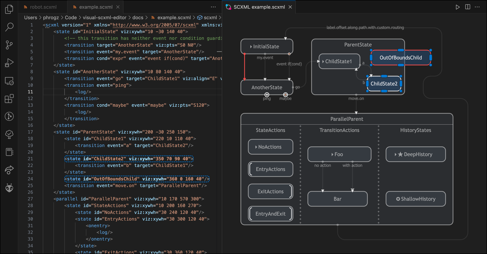

# Visual SCXML Editor

An extension for Visual Studio Code that visualizes SCXML state charts,
and provides the ability to visually adjust the state chart,
in a manner that allows the SCXML to still be used in production.



## Features

* Parallel editing allows you to modify either the XML code or the graphics and have the other
  reflect the changes
* Visual changes are stored in a custom namespace that does not affect SCXML operation
* Visualization goes beyond just states and transition flow:
  * See which states have actions performed on entry or exit
  * See which transitions execute actions
  * See which transitions have conditions guarding them, or have no condition or event at all.
  * See transitions that just execute an action, but don't leave the state.
* Visually differentiates transitions with actions
* Visually differentiates transitions with conditions
* Selecting graphical objects highlights them in the text editor, making them easy to find for
  hand-editing or detailed inspection
* Default visual style matches the current VS Code theme
  * Customization of state colors allows for additional information to be conveyed
* Inspector palette supports authoring of custom actions ([see below](#authoring-custom-executable-actions) for details)
* Route transitions around states via waypoints
  * Currently requires hand-editing the XML attribute to inject waypoints;
    see the [documentation on visualization attributes](docs/attributes.md#transitions) for details


## Instructions

1. Open an SCXML file, _ensure that the language for the file is set to XML_,
   and then invoke the command `SCXML Editor: Open to the Side`
   * If this is your first time working on this file, the `Layout Entire Diagram`
     command will be run for you to roughly make an initial sensible layout.
2. Drag states to impose order and clarity.
3. Select states or transitions and edit some aspects of them in the Inspector palette
   that appears.


### Available Commands

* `SCXML Editor: Open to Side` — Opens a visual editor tied to the current SCXML document; only
  available if the language for the active text editor is set to XML.
* `SCXML Editor: Layout Entire Diagram` — Moves all states to hopefully-useful initial places.
  Also resets any existing transition routing to the defaults.
* `SCXML Editor: Expand State to Fit Children` — Parent state(s) selected in the visual editor will
  have their placement adjusted to ensure all children fit within them.
* `SCXML Editor: Add State` (or `Add Child State`) — Creates new state(s) in the state machine.
  If any state(s) are selected the new states are added as children of them.
  Also available via context menu in the visual editor.
* `SCXML Editor: Add Transition` — Creates new transition(s) in the state machine, starting at the
  selected state(s). (If no states are selected, uses a quick pick to select a state to start from.)
  Quick picks also let you select the target state, and specify an event name and conditional.
  The command is also available via context menu in the visual editor.
* `SCXML Editor: Zoom to Fit` — Fit the entire state machine in the visual editor.
* `SCXML Editor: Zoom to Selected` — Fit the selected state(s) and transition(s) in the view.
* `SCXML Editor: Zoom to 100%` — Adjust the zoom to the base size.
* `SCXML Editor: Show/Hide Events` — Toggle the display of transition events.
* `SCXML Editor: Delete Selection Only` — Delete selected state(s) and transition(s) in a
  least-destructive manner:
  * Unselected child-states are not deleted, but are instead re-parented up a level.
  * Transitions targeting any state(s) to be deleted are not themselves deleted, but instead have
    their `target` attribute changed to not target that state.
* `SCXML Editor: Delete Selection and References` — Delete selected state(s) and transition(s) in
  the most destructive manner:
  * Descendant states are also deleted.
  * Transitions targeting state(s) to be deleted are also deleted.


### Keyboard Controls in the Visual Editor

* `Space` — enable pan via left mouse drag
* `Middle-MouseWheel Drag` — pan around the document
* `Trackpad Scroll` — pan around the document
* `Trackpad Pinch` — zoom in/out
* `Ctrl-MouseWheel` — zoom in/out
* `MouseWheel` — pan up/down
* `Shift-MouseWheel` — pan left/right
* `Delete` — Delete Selection Only
* `Shift+Delete` — Delete Selection and References
* `Ctrl+Alt+Z`/`Cmd+Alt+Z` — Zoom to Fit
* `Alt+Shift+Z` — Zoom to 100%
* `e` — Show/Hide Events


### Authoring Custom Executable Actions

In addition to the [`<send>` element](https://www.w3.org/TR/scxml/#send) allowing the state machine to
communicate with the owning program—given interpreter support—the SCXML specification also allows for
[custom action elements](https://www.w3.org/TR/scxml/#extensibility) in custom namespaces where other
executable content would be present.

When these custom actions are present onentry, onexit, or within a transition, the Inspector palette
will show the actions and their attributes, and allow them to be deleted. It does not support editing
them or creating new custom actions from the palette, however, unless you provide information about the
schema.

To describe the custom actions that can be edited and created, add an element named `actions` in the
visualization namespace at the root of the SCXML document. Each child of this element should be an
element you'd like to be able to edit—in the proper namespace—with child elements describing the allowed
attributes.

For example:

```xml
<scxml xmlns="http://www.w3.org/2005/07/scxml" version="1.0"
       xmlns:robo="http://dawsonschool.org/robotics/2972"
       xmlns:viz="http://phrogz.net/visual-scxml">
  <viz:actions>
    <!-- e.g. <robo:enableDriving value="0" /> -->
    <robo:enableDriving>
      <viz:attribute max="1" min="0" name="value" type="int" />
    </robo:enableDriving>

    <!-- e.g. <robo:toggle key="armRaised" value="1" /> -->
    <robo:toggle>
      <viz:attribute name="key" type="choice" values="armRaised,gripperOpen" />
      <viz:attribute max="1" min="0" name="value" type="int" />
    </robo:toggle>

    <!-- e.g. <robo:doMagic magic="retractBoom" /> -->
    <robo:doMagic>
      <viz:attribute name="magic" type="choice" values="(none),alignToPiece,extendBoom,retractBoom,autoReverse,driveToGrid" />
    </robo:doMagic>

    <!-- e.g. <robo:speak message="Hi Mom!" /> -->
    <robo:speak>
      <viz:attribute name="message" type="string" />
    </robo:speak>
  </viz:actions>
```

Each `<viz:attribute>` must have a `name` and `type` attribute. Supported attribute types:

* `string` — arbitrary text input
* `choice` — text from a list of values
  * `values` must be a comma-delimited list of options to provide
* `int` – integer
  * optional `min` and `max` attributes constrain the range
* `float` – floating point number
  * optional `min` and `max` attributes constrain the range
  * `step` optionally defines the increment/decrement amounts and controls precision
* `boolean` – values of "true" or "false" only

## Known Issues, Planned Features

All issues and planned features are tracked using [GitHub Issues](https://github.com/Phrogz/visual-scxml-editor/issues):

* [Major bugs](https://github.com/Phrogz/visual-scxml-editor/issues?q=is%3Aissue+is%3Aopen+label%3Abug+label%3Ahigh-value) are labeled with `bug` && `high-value`; alternatively, see [all bugs](https://github.com/Phrogz/visual-scxml-editor/issues?q=is%3Aissue+is%3Aopen+label%3Abug).
* [Major features](https://github.com/Phrogz/visual-scxml-editor/issues?q=is%3Aissue+is%3Aopen+label%3Afeature+label%3Ahigh-value) are similarly labeled `feature` and `high-value`; alternatively, see [all features](https://github.com/Phrogz/visual-scxml-editor/issues?q=is%3Aissue+is%3Aopen+label%3Afeature).


## Contributing

Want to help fix bugs or add features? Great! See the [Architecture documentation](docs/architecture.md)
for core concepts on how the extension works and information flows.

## Release Notes

### 0.5.0 (unreleased)

* `Add Transition` command lets you create a transition with minimal typing

### 0.4.0 2023-Feb-28

* Ctrl+S/Cmd+S with the visual editor focused will save the text editor
* Added `Layout Entire Diagram` command for automatic initial layout
  * Automatically invoked when opening a new SCXML file
* Added `Zoom to Selected` command
* SCXML parse errors show up in the Problems panel, clear when OK
* Fixed bugs related to selection and dragging with left and right clicks

### 0.3.0 : 2023-Feb-27

Initial public release.
