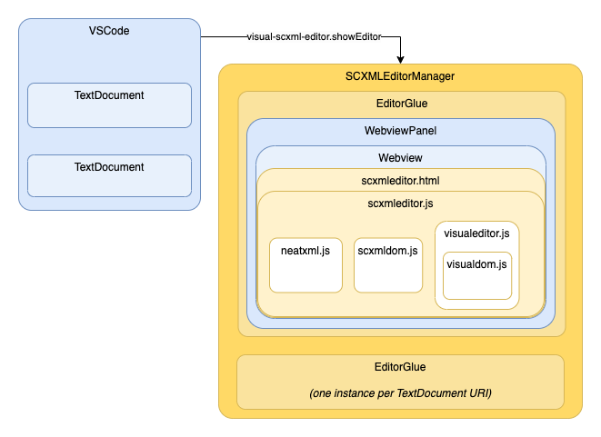
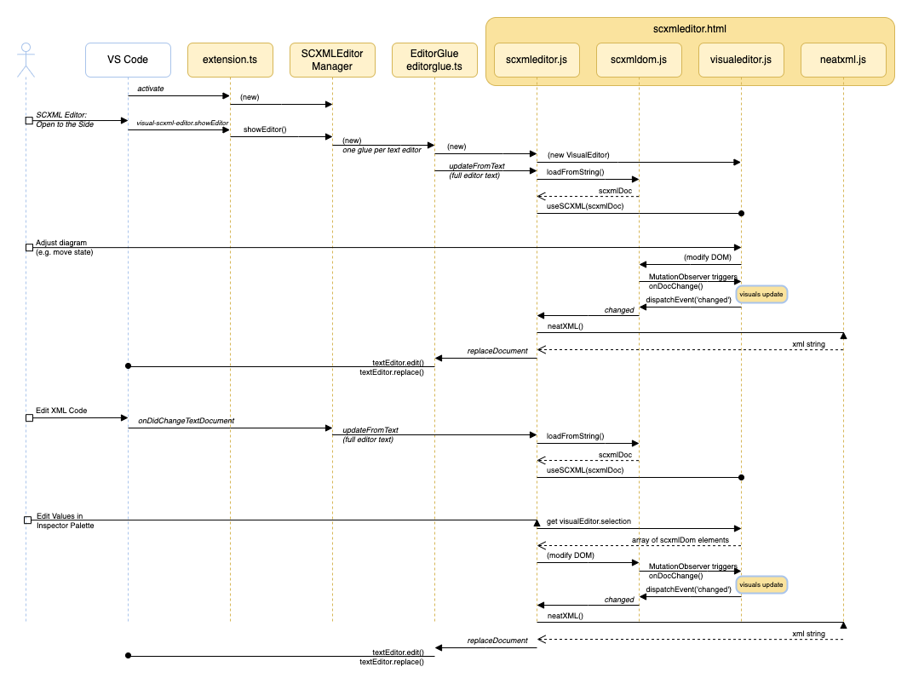
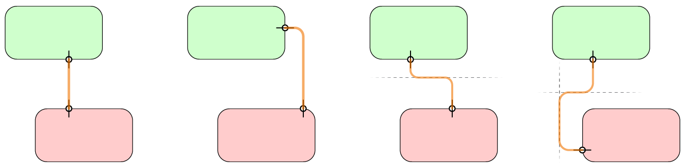
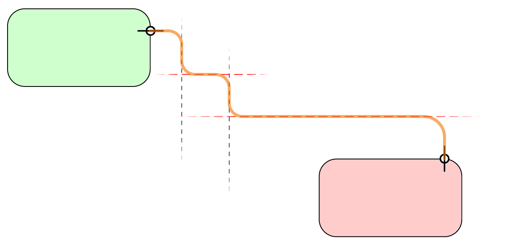
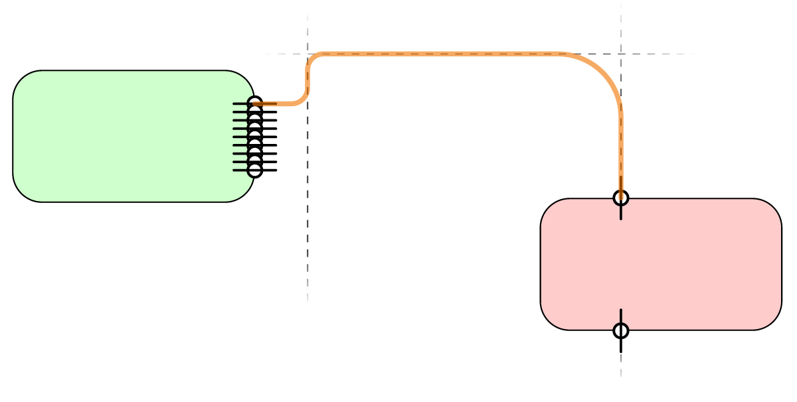
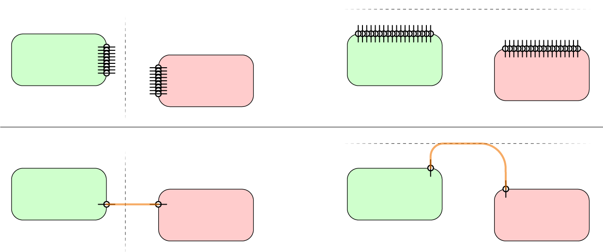

This document captures the design architecture of this extension: what files do, how data flows
between modules.

# High-Level Overview

1. [`extension.ts`](../src/extension.ts) creates an `SCXMLEditorManager` when activated.
   For each text editor document where the `showEditor` command is invoked, the manager
   creates a new `EditorGlue` instance [`editorglue.ts`](../src/editorglue.ts) and associates
   it with the document uri.
2. Each `EditorGlue` instance creates its own `WebviewPanel` where the visualization takes place,
   building it from [`scxmleditor.html`](../resources/scxmleditor.html), which in turn pulls
   in other files in the [`resources`](../resources) directory.
   * The HTML page uses a big [SVG](https://developer.mozilla.org/en-US/docs/Web/SVG) diagram to
     show the states, transitions, and selection/manipulation handles. The HTML sets up the SVG
     shell, including the shapes of the "markers" that are applied to the ends of transitions.
     The rest of the SVG is created dynamically by [`visualeditor.js`](../resources/visualeditor.js).
   * Visually, the following CSS files are applied to the document:
     * **[`base.css`](../resources/base.css)** layout of the page elements, including the Inspector
     * **[`scxmleditor.css`](../resources/scxmleditor.css)** base style for all diagram pieces
     * **[`theme.css`](../resources/theme.css)** colors the diagram based on the current VS Code theme
     * **[`mutable.css`](../resources/theme.css)** holds styles to be modified by script at runtime
   * Programmatically, [`scxmleditor.js`](../resources/scxmleditor.js) is the only script loaded directly
     by the HTML; that library then imports other modules. Responsibilities by file:
     * **[`scxmleditor.js`](../resources/scxmleditor.js)** is the glue that pulls everything together:
       * creates the SCXMLDocument and VisualEditor and hooks them together
       * populates the Inspector when states/transitions are selected, and feeds changes to the SCXMLDoc
       * passes selection information back to the `EditorGlue`, to show selection in the text editor
     * **[`scxmldom.js`](../resources/scxmldom.js)** creates an in-memory representation of the SCXML
       document as an [`XMLDocument`](https://developer.mozilla.org/en-US/docs/Web/API/XMLDocument),
       except that the document and DOM elements in the tree are given additional functionality
       specific to SCXML.
     * **[`visualeditor.js`](../resources/visualeditor.js)** implements the editor that manages the SVG
       diagram: placing and sizing and coloring states, routing of transitions, placement
       of labels, showing selection handles, handling mouse interactions, resizing elements.
       Changes to the diagram mutate the SCXMLDocument document.
     * **[`neatxml.js`](../resources/neatxml.js)** provides stable, custom serialization of the in-memory
       XML document to produce updated code for the editor when the SCXMLDoc changes
3. The `EditorGlue` receives commands from the webview to rewrite the editor's text to match the
   visual changes, or to show selections in the editor.

# SCXML DOM

The SCXML text in the editor is first passed to [`scxmldom.js`](../resources/scxmldom.js).
This module creates an in-memory representation of an SCXML document as an
[`XMLDocument`](https://developer.mozilla.org/en-US/docs/Web/API/XMLDocument), except that the DOM
elements in the tree are given additional functionality specific to SCXML.
These properties and methods are intended as conveniences, and to help ensure a valid SCXML document
(not just valid XML).

* **`SCXMLDoc`** — added to the XMLDocument itself.
* **`SCXMLState`** — added to every `<scxml>`, `<state>`, `<parallel>`, `<history>`, and `<final>` element.
* **`SCXMLTransition`** — added to every `<transition>` element.
* **`SCXMLScript`** — added to every `<script>` element.
* **`SCXMLCustom`** — added to other elements, primarily intended for use with elements for custom actions.

_See the implementation of the above objects for the properties and methods they provide._

# Visual DOM

Once the SCXMLDoc is created and passed to [`visualeditor.js](../resources/visualeditor.js),
MORE prototypes are injected into certain elements, defined in [`visualdom.js`](../resources/visualdom.js).
These properties and methods manage the visual state of the diagram, outside the scope of just SCXML.

* **`VisualDoc`** — a simple extension to the XMLDocument which ensures that newly-created elements
  get properly injected with the new prototypes.
* **`VisualRoot`** — added just to the root `<scxml>` element.
* **`VisualState`** — added to state elements (other than `<scxml>`.
* **`VisualTransition`** — added to `<transition>` elements.

_See the implementation of the above objects for the properties and methods they provide._

## Calculating Transition Routing

A surprising amount of calculation goes into finding the "right" path for a transition to take.
This section describes how the path is calculated.

### Tterminology and Basic Concepts

* An "anchor" is a point in space through which the path must pass, including the horizontal/vertical
  orientation of the path as it passes through the point.
* A "wayline" is an infinite horizontal or vertical line through which the path must pass next.
  For example, a wayline specified as "X100" is a vertical line laterally placed at global x=100.

The simplest cases occur when anchors exist on both states, and any waylines alternate orientation.
For example:

It becomes more difficult when sequential waylines exist with the same orientation.
For the path to travel from one to the next, internally we must inject waylines with the opposite
orientation between each pair. These waylines initially have orientation only,
with automatic placement to be calculated to distribute distances traveled. For example:

In the above, the two vertical waylines and the vertical orientation of the rightmost anchor require
the path to be traveling vertically, with no horizontal wayline specified between them. The horizontal
waylines shown in red are inserted, with their Y values computed to evenly distribute the vertical
changes.

Finally, calculations become tricker still if explicit anchors are omitted from one or both and states.
In these situations, we look at the adjacent wayline to select candidate anchors, but must look for
more information to select which candidate is best. For example:

Above, given the vertical wayline to the right of the state on the left we procedurally decide that
the transition should be attached to the right edge of the state. Where along that edge to attach to
depends on where the line goes next. Similarly, the vertical wayline passing through the state on the
right dictates that we should attach the transition to where the wayline intersects the top or bottom
edge…but we can only pick which one once we know the next Y constraint. The horizontal wayline provides
the information we need for both states to select our anchor points and create the path.

### Steps to Creating the Path

1. If neither state has an explicit anchor, and there are no waylines, a special method
   (`VisualTransition.bestAnchors()`) is called to select the most desirable anchors on each state.
   Otherwise…
2. If either end of the path is not an anchor, and there is at least one wayline, for each state pick a
   side and inject an "anchor range" based on the closest wayline. (`bestStateAnchorTowards()`);
3. Resolve anchor ranges to be fully-constrained anchors by crawling along the path to find the next
   constraint on the loosely-constrained axis, and use that to pick the closest point.
   1. If there is no next fully-constrained value—if there are no waylines parallel to the axis of
      freedom for the anchor range, and the opposite state's anchor is also an anchor range—then
      the two anchor ranges are compared to find the best points.
      
4. Pairs of adjacent waylines with the same orientation have a wayline of the opposite orientation
   injected between them.
5. After all orientation-only waylines are created, find the constraining values on either end and set
   the values for the waylines to divide the space up evenly.
6. Find the intersection points of all anchors and waylines.
7. Finally, crawl along the list of intersection points and construct the curving path.